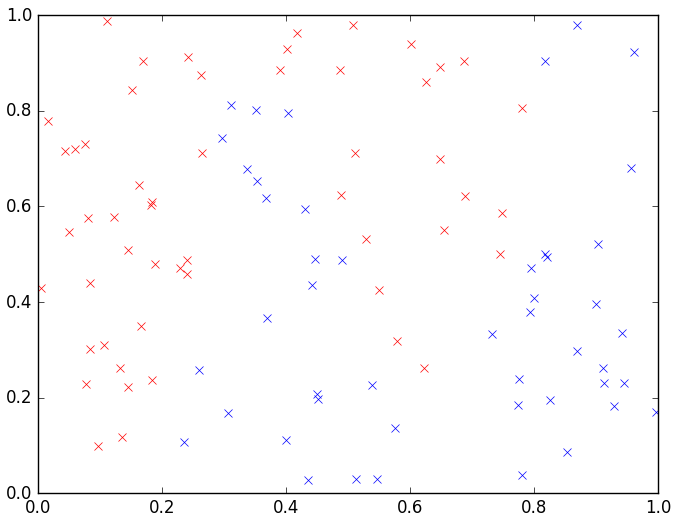
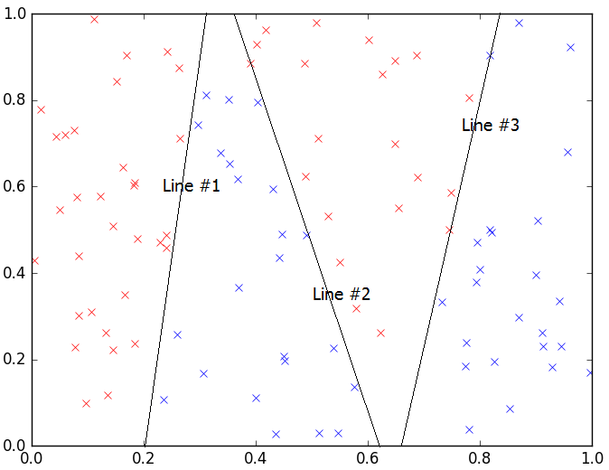
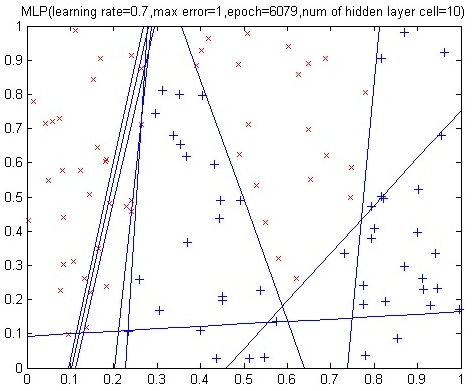
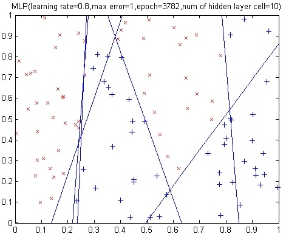
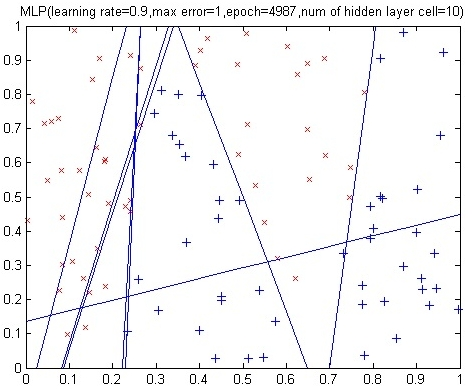
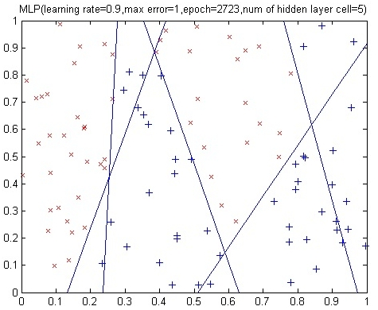
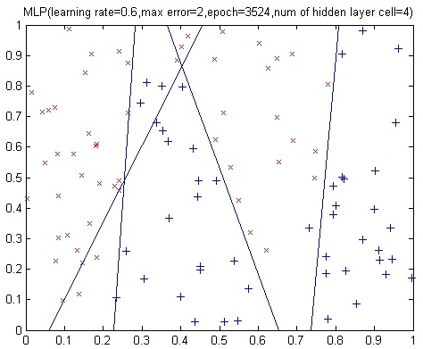
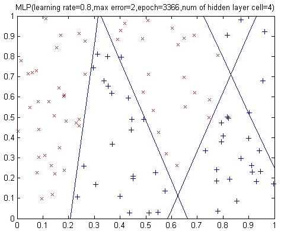

Neural Network (NN) is a computational approach, which is based on a large collection of neural units (AKA artificial neurons), loosely modeling the way a biological brain solves problems using large clusters of biological neurons connected by axons.

one of the applications of neural networks is to solve classification problems. Assume that you have a set of sample data which consist of two classes (let's say class A and class B). Here, the goal is to classify the samples, in other words, label them as either "A" or "B".

The type of Neural Network we use for this problem is called Multi-layer perceptron (MLP) which utilizes a supervised
technique called [back-propagation](https://en.wikipedia.org/wiki/Backpropagation) for training the network. 
(If you forgot how NN works or you don't know at all, I suggest first
you read [this tutorial](http://www.inf.ed.ac.uk/teaching/courses/tcm/lectures/tcm03_ann.pdf) to understand neural networks).

In this tutorial we are going to write a python code to implement a simple neural network and solve a simple classification problem using a dataset we created.
You can download the dataset from [here](../assets/content/nn_data.rar).


### Description of the dataset

Our sample data has two features and one label (three columns in total) like the table below:


|#|Feature #1|Feature #2| Lable (class)|
|---|--------|----------|--------------|
|1|0.1622|0.6443|0|
|2|0.7943|0.3786|1|
|3|0.3112|0.8116|1|
|...|...|...|...|


As you can see, each sample has two features (X and Y) and one class (label) which is either 0 or 1. Consider these two features as the coordinates on the map.
In total, our database have 100 samples.

Let's plot our sample using [matplotlib](https://matplotlib.org/) library to see the distribution of the samples.

```python
from matplotlib import pyplot as plt
import numpy as np
my_data = np.genfromtxt('data.txt');
class1 = my_data[my_data[:,2]==1]
class2 = my_data[my_data[:,2]==0]
plt.plot(class1[:,0],class1[:,1],'bx',class2[:,0],class2[:,1],'rx')
plt.show()
```



Red cross shows the samples with label (class) 0 and blue cross shows the samples with label 1.
As you can see, there is no linear way to split this data into two separate parts based on the labels. In other words, you can 
**NOT** draw a simple line and say "Whatever is below the line is 0 and whatever is above the line is 1 (or vice versa)".

Here is where Neural Network is useful. It can separate the sample space into several parts based on some rules and 
tell us: "Whatever that is below line #1 and above line #2 is 0 and whatever is on the left side of line #X and above line #Z is 1". 
Let's try to manually draw these imaginary lines to better understand the behavior of the Neural Network. 
For this purpose, I draw three lines (line #1, #2, and #3) as below:



So having these three lines, with four rules, I can split the dataset based on the labels:
 
- whatever is on the left side of line #1 is 0
- whatever is between line #1 and line #2 is 1
- whatever is between line #2 and line #3 is 0
- and finally, whatever is on the right side of line #3 is 1


This is exactly what neural networks do. By using a three-layer neural network, the hidden layer is responsible for drawing these imaginary 
lines and the output layer tells us the rules which we can separate the data based on.

Here is the [source code](../assets/content/nn_class_py.txt) of the network I wrote.
After running the source code with various parameters, we get the following results.














So simply, what we did was to try to create the same (imaginary) lines but using a machine learning approach!
